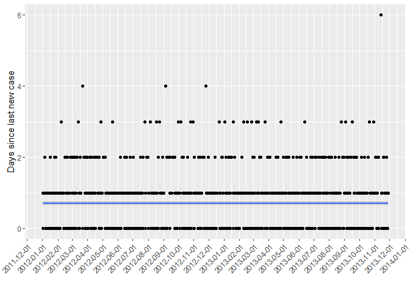
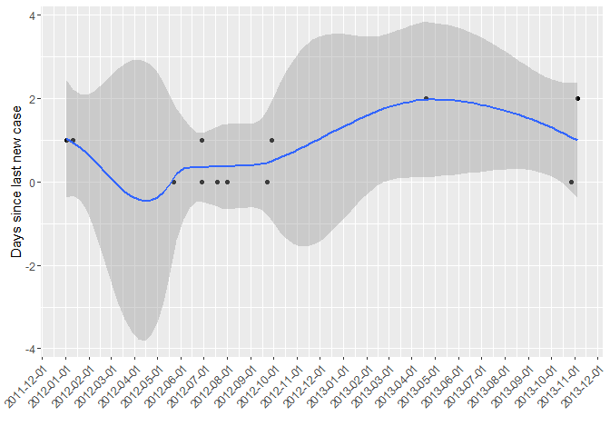
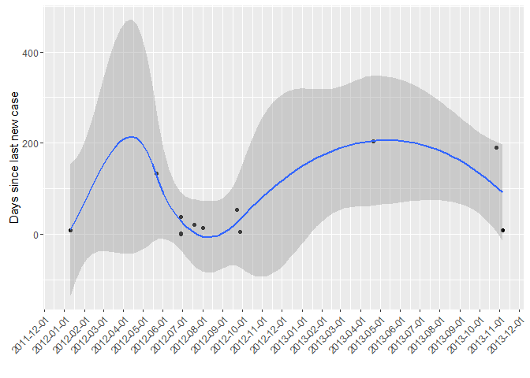
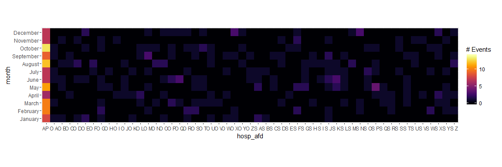
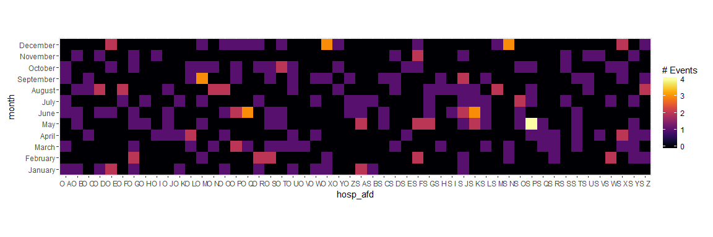

MadsR - let's get to the fun part.

MadsR is a package designed for my own uses with data from the danish
microbiological system MADS.

Installation
------------

    devtools::install_github("marcmtk/MadsR")

Functions implemented
---------------------

This package provides 6 functions to assist with epidemiological
analyses of MADS data and 2 functions to generate MADS like data for
testing purposes.

-   `read_mads` - reads a csv file, applies appropriate types to
    columns, adds time columns and splits name of sender into
    useful categories.
-   `filter_cases` - easy filtering of first episode in a timewindow.
-   `since_last` - calculates the time since a new positive sample was
    last seen.
-   `tally_by_department` - calculates positive cases by department,
    provides functions to exclude observations based on different
    windows, see examples
-   `slplot` - a "Since last" plot
-   `tally_map` - a heatmap of tally data
-   `generate_MADS_like_data` - as the name implies
-   `generate_res` - generates resistance patterns

Examples
--------

Consider the dataset provided in analyser-like.csv with read\_csv vs
read\_mads

    getwd()

    ## [1] "I:/Dokumenter/Dropbox/Programmering/R/MadsR"

    df <- read.csv("./extdata/analyser-like.csv")
    str(df)

    ## 'data.frame':    1000 obs. of  7 variables:
    ##  $ cprnr.  : int  168 6 339 190 325 333 212 157 107 72 ...
    ##  $ navn    : logi  NA NA NA NA NA NA ...
    ##  $ afsendt : int  29052013 16102012 12042012 25112012 8032013 2042012 3102012 15102013 1082012 21112012 ...
    ##  $ modtaget: logi  NA NA NA NA NA NA ...
    ##  $ besvaret: logi  NA NA NA NA NA NA ...
    ##  $ afsender: Factor w/ 352 levels "00071","00389",..: 278 344 343 340 340 282 306 314 340 231 ...
    ##  $ result  : Factor w/ 2 levels "Negativ","Positiv": 1 1 1 1 1 1 1 1 1 1 ...

    head(df)

    ##   cprnr. navn  afsendt modtaget besvaret afsender  result
    ## 1    168   NA 29052013       NA       NA    47454 Negativ
    ## 2      6   NA 16102012       NA       NA      S R Negativ
    ## 3    339   NA 12042012       NA       NA      S Q Negativ
    ## 4    190   NA 25112012       NA       NA      S N Negativ
    ## 5    325   NA  8032013       NA       NA      S N Negativ
    ## 6    333   NA  2042012       NA       NA    47535 Negativ

    df <- read_mads("./extdata/analyser-like.csv", "analyser")
    str(df)

    ## 'data.frame':    1000 obs. of  16 variables:
    ##  $ cprnr.  : int  168 6 339 190 325 333 212 157 107 72 ...
    ##  $ navn    : logi  NA NA NA NA NA NA ...
    ##  $ afsendt : Date, format: "2013-05-29" "2012-10-16" ...
    ##  $ modtaget: Date, format: NA NA ...
    ##  $ besvaret: Date, format: NA NA ...
    ##  $ afsender: chr  "47454" "S R" "S Q" "S N" ...
    ##  $ hospital: chr  "AP" "S" "S" "S" ...
    ##  $ afdeling: chr  "" "R" "Q" "N" ...
    ##  $ afsnit  : chr  NA NA NA NA ...
    ##  $ result  : chr  "Negativ" "Negativ" "Negativ" "Negativ" ...
    ##  $ year    : num  2013 2012 2012 2012 2013 ...
    ##  $ quarter : num  2 4 2 4 1 2 4 4 3 4 ...
    ##  $ month   : Ord.factor w/ 12 levels "January"<"February"<..: 5 10 4 11 3 4 10 10 8 11 ...
    ##  $ week    : num  22 42 15 48 10 14 40 42 31 47 ...
    ##  $ weekday : Ord.factor w/ 7 levels "Sunday"<"Monday"<..: 4 3 5 1 6 2 4 3 4 4 ...
    ##  $ hosp_afd: chr  "AP " "S R" "S Q" "S N" ...

    head(df)

    ##   cprnr. navn    afsendt modtaget besvaret afsender hospital afdeling
    ## 1    168   NA 2013-05-29     <NA>     <NA>    47454       AP         
    ## 2      6   NA 2012-10-16     <NA>     <NA>      S R        S        R
    ## 3    339   NA 2012-04-12     <NA>     <NA>      S Q        S        Q
    ## 4    190   NA 2012-11-25     <NA>     <NA>      S N        S        N
    ## 5    325   NA 2013-03-08     <NA>     <NA>      S N        S        N
    ## 6    333   NA 2012-04-02     <NA>     <NA>    47535       AP         
    ##   afsnit  result year quarter    month week   weekday hosp_afd
    ## 1   <NA> Negativ 2013       2      May   22 Wednesday      AP 
    ## 2   <NA> Negativ 2012       4  October   42   Tuesday      S R
    ## 3   <NA> Negativ 2012       2    April   15  Thursday      S Q
    ## 4   <NA> Negativ 2012       4 November   48    Sunday      S N
    ## 5   <NA> Negativ 2013       1    March   10    Friday      S N
    ## 6   <NA> Negativ 2012       2    April   14    Monday      AP

Let's filter some cases and look at the results

    cases <- filter_cases(df, result=="Positiv", min.days.to.new.episode=14)
    table(cases$hosp_afd, cases$episode)

    ##      
    ##        1  2  3
    ##   AP  28  5  1
    ##   O A  2  0  0
    ##   O B  1  0  0
    ##   O C  2  0  0
    ##   O D  1  1  0
    ##   O E  1  0  0
    ##   O F  3  0  0
    ##   O H  3  0  0
    ##   O I  1  0  0
    ##   O K  3  0  0
    ##   O L  3  0  0
    ##   O M  3  1  0
    ##   O N  1  0  0
    ##   O O  1  0  0
    ##   O P  1  2  0
    ##   O Q  1  1  0
    ##   O S  1  0  0
    ##   O T  1  0  0
    ##   O U  0  1  0
    ##   O V  1  0  0
    ##   O W  1  0  0
    ##   O Y  2  0  0
    ##   O Z  2  0  0
    ##   S A  1  0  0
    ##   S C  2  0  0
    ##   S F  2  0  0
    ##   S I  4  0  0
    ##   S J  2  0  0
    ##   S K  2  0  0
    ##   S M  1  0  0
    ##   S N  0  1  0
    ##   S O  2  0  0
    ##   S P  1  0  0
    ##   S T  3  1  0
    ##   S U  2  0  0
    ##   S X  2  1  0
    ##   S Y  1  0  0
    ##   S Z  3  0  0

    table(cases$sl)

    ## 
    ##  15  17  53  95 124 144 306 315 343 369 437 470 530 534 598 
    ##   1   1   1   1   1   1   1   1   1   1   1   1   1   1   1

Now let's look at a since last plot, after all there may be an epidemic
out there!

    since_last(df) %>% slplot()

<!-- -->

    since_last(df) %>% filter(hosp_afd=="S V") %>% slplot()

<!-- -->

    filter(df, hosp_afd == "S V") %>% since_last() %>% slplot()

<!-- -->

    tbd <- tally_by_department(df, "patient", result == "Positiv")

    ## Joining by: c("hosp_afd", "year", "month")
    ## Joining by: c("hosp_afd", "year", "month")

    tally_map(tbd)

<!-- -->

    filter(tbd, hosp_afd != "AP ") %>% tally_map

<!-- -->

Note the difference between plot 2 and plot 3. It is very important that
time since last positive case is computed *after* relevant filtering.
